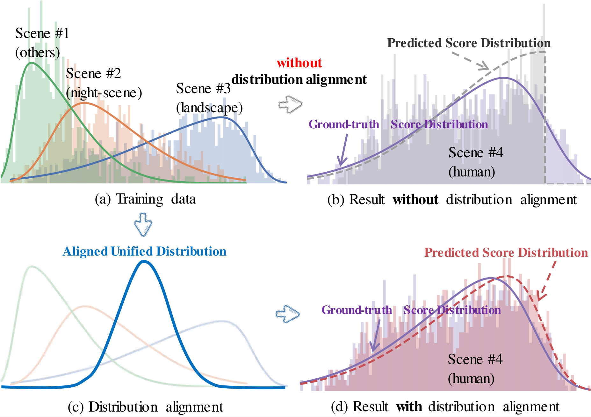
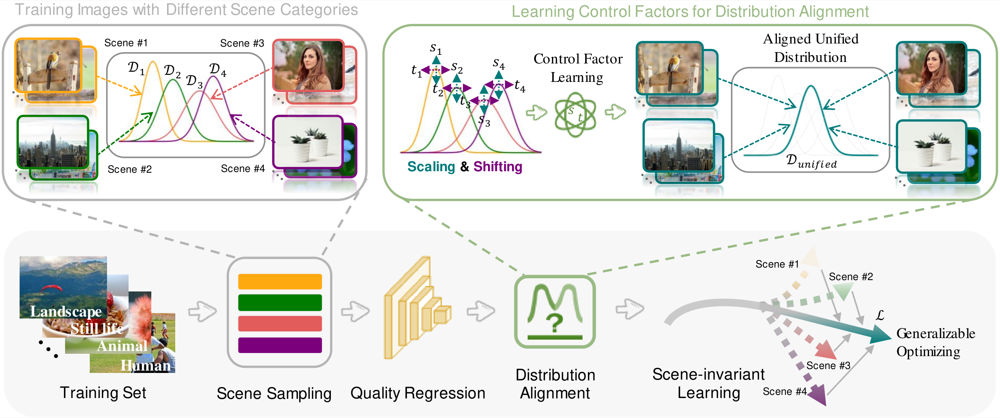
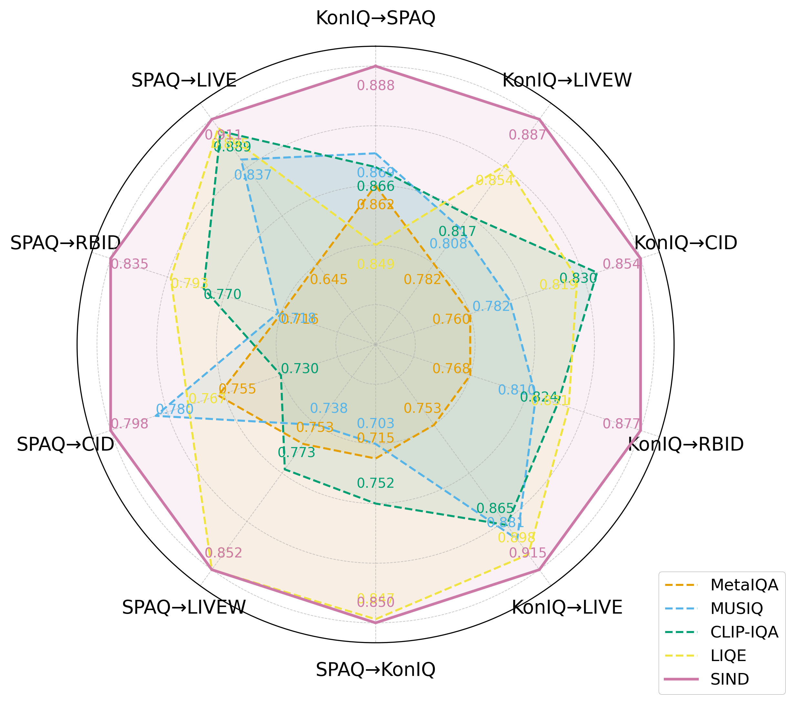

# SIND: Scene-Invariant Distribution Learning for Generalizable Image Quality Assessment [TCSVT]

This repository contains the official implementation of the paper "SIND: Scene-Invariant Distribution Learning for Generalizable Image Quality Assessment".

## Introduction

Image Quality Assessment (IQA) is crucial for various computer vision tasks, but existing deep learning-based IQA models often struggle with generalization across different scenes. We propose SIND, a novel framework that learns scene-invariant distributions for robust quality assessment through cross-scene distribution alignment.

<p align="center">
  
  </br>
  <em>Distribution alignment visualization: (a) Training data from three scenes, (b) Prediction without alignment, (c) Distribution alignment process, (d) Prediction with alignment</em>
</p>

## Framework

<p align="center">
  
  </br>
  <em>Overview of SIND: (1) Scene Sampling selects k scenes and n images per scene, (2) Distribution Alignment learns scene-specific transformations, (3) Model learns scene-invariant distributions</em>
</p>

## Features

- Scene-invariant distribution learning framework
- Cross-scene distribution alignment strategy
- Token-complementary patch reasoning network
- Support for both technical and aesthetic quality assessment
- Model-agnostic design compatible with various backbones (ViT, ResNet)

## Installation

```bash
git clone https://github.com/username/SIND
cd SIND
pip install -r requirements.txt
```

## Data Preparation

1. Download the following datasets:
   - Technical Quality Assessment (TQA):
     - SPAQ
     - KonIQ-10k
     - LIVEW
     - CID2013
     - RBID
     - LIVE
   - Aesthetic Quality Assessment (AQA):
     - EVA
     - PARA
2. Organize the data following this structure:
```
data/
├── SPAQ/
├── KonIQ-10k/
├── LIVEW/
├── CID2013/
├── RBID/
├── EVA/
└── PARA/
```
3. [Optional] Split the data into training and validation sets and generate JSON files. Most of the datasets are splited following [Q-Align](https://github.com/Q-Future/Q-Align), please refer `data_json/data_json_generator.py` for details.

    Or you can directly use the provided JSON files in `data_json/`.


## Training and Evaluation

### Cross-scene Validation
Train and evaluate on a single dataset with leave-one-out cross-scene validation. Refer to paper and `train_test_IQA.py` for more details.
```bash
# [Example] Train and evaluate on SPAQ dataset with leave-one-out cross-scene validation

cd "$(dirname "$0")"
pro_dir="./exp_log/leave_one_out/our_epoch35_bs128_spaq"
mkdir -p $pro_dir
clip_model="openai/ViT-B-16"

CUDA_VISIBLE_DEVICES=0,1 accelerate launch \
                    train_test_IQA.py  \
                    --clip_model $clip_model \
                    --epochs 35 \
                    --lr 1e-5  \
                    --warmup_epoch 5 \
                    --weight_decay 1e-5 \
                    --batch_size 64 \
                    --local_global \
                    --loss_type scale_shift \
                    --scene_sampling 2 \
                    --project_dir $pro_dir \
                    --train_dataset spaq \
                    --test_dataset spaq \
                    --exp_type leave-one-out \
                    >> $pro_dir/train.log 

# Main configurations:
# - train_dataset: spaq / koniq10k / eva / para
# - loss_type: scale_shift if using alignment, l1 if not using alignment
# - scene_sampling: 2 (per GPU) if using alignment, 0 if not using alignment
# - local_global: enable token-complementary patch reasoning
# - exp_type: leave-one-out
```

### Cross-dataset Evaluation
Train on SPAQ and/or KonIQ-10k dataset and test on other datasets without fine-tuning. Refer to paper and `cross_set_exp.sh` for more details.
```bash
# [Example] Train on SPAQ, test on KonIQ-10k, LIVEW, LIVE, RBID, CID2013
# use scene-domain alignment (default)
cd "$(dirname "$0")"
pro_dir="./exp_log/cross-set/our_epoch35_bs128_spaq"
mkdir -p $pro_dir
clip_model="openai/ViT-B-16"

CUDA_VISIBLE_DEVICES=0,1 accelerate launch \
                    train_test_IQA.py  \
                    --clip_model $clip_model \
                    --epochs 35 \
                    --lr 1e-5  \
                    --warmup_epoch 5 \
                    --weight_decay 1e-5 \
                    --batch_size 64 \
                    --local_global \
                    --loss_type scale_shift  \
                    --scene_sampling 2 \
                    --project_dir $pro_dir \
                    --train_dataset spaq \
                    --test_dataset koniq10k spaq livec live bid cid2013 \
                    --exp_type cross-set \
                    >> $pro_dir/train.log 

# [Example] Train on SPAQ and KonIQ-10k, test on KonIQ-10k, SPAQ, LIVEW, LIVE, BID, CID2013
# use dataset-domain alignment
cd "$(dirname "$0")"
pro_dir="./exp_log/cross-set/our_epoch35_bs128_spaq_koniq_dataset"
mkdir -p $pro_dir
clip_model="openai/ViT-B-16"

CUDA_VISIBLE_DEVICES=0,1 accelerate launch \
                    train_test_IQA.py  \
                    --clip_model $clip_model \
                    --epochs 35 \
                    --lr 1e-5  \
                    --warmup_epoch 5 \
                    --weight_decay 1e-5 \
                    --batch_size 64 \
                    --local_global \
                    --loss_type scale_shift  \
                    --scene_sampling 2 \
                    --project_dir $pro_dir \
                    --train_dataset spaq koniq10k \
                    --test_dataset koniq10k spaq livec live bid cid2013 \
                    --exp_type cross-set \
                    --dataset_domain \
                    >> $pro_dir/train.log 

# Main configurations:
# - train_dataset: spaq / koniq10k / spaq koniq10k
# - loss_type: scale_shift if using alignment, l1 if not using alignment
# - scene_sampling: 2 (per GPU) if using alignment, 0 if not using alignment
# - local_global: enable token-complementary patch reasoning
# - exp_type: cross-set
# - dataset_domain: use dataset-domain alignment instead of scene-domain alignment
```

### Experiment Types

The framework supports three types of experiments:

- `leave-one-out`: Cross-scene validation within a single dataset
- `cross-set`: Cross-dataset validation
- `random-split`: Random split validation floowing the [LIQE](https://github.com/zwx8981/LIQE) setup

### Main Arguments

- `--train_dataset`: Training dataset (`spaq`, `koniq10k`, `eva`, `para`)
- `--test_dataset`: Testing dataset (`spaq`, `koniq10k`, `eva`, `para`, `livec`, `live`, `bid`, `cid2013`)
- `--local_global`: Enable token-complementary patch reasoning
- `--loss_type`: `scale_shift` if using alignment, `l1` if not using alignment
- `--scene_sampling`: Number of scenes per GPU in a mini-batch (`0` for no scene sampling)
- `--exp_type`: Experiment type (`leave-one-out`, `cross-set`, `random-split`)
- `--dataset_domain`: Use dataset-domain alignment instead of scene-domain alignment


## Results

Cross-scene validation results on SPAQ, KonIQ-10k, EVA, and PARA datasets:

| Dataset | SRCC | PLCC |
| --- | --- | --- |
| SPAQ | 0.861 | 0.889 |
| KonIQ-10k | 0.919 | 0.935 |
| EVA | 0.778 | 0.792 |
| PARA | 0.902 | 0.940 |

Cross-dataset validation:

<p align="center">
  
  </br>
  <em>Cross dataset generalization performance of different methods when trained on SPAQ or KonIQ-10k. Metric is (SRCC+PLCC)/2.</em>
</p>

## Citation

If you find this work useful for your research, please cite our paper:

@article{SIND2024,

 title={SIND: Scene-Invariant Distribution Learning for Generalizable Image Quality Assessment},

 author={},

 journal={},

 year={2024}

}

## License

This project is released under the MIT License.

## Acknowledgements

- Built upon the [OpenCLIP](https://github.com/mlfoundations/open_clip) and [HyperIQA](https://github.com/SSL92/hyperIQA)
- Evaluation metrics: SRCC (Spearman Rank Correlation Coefficient) and PLCC (Pearson Linear Correlation Coefficient)
